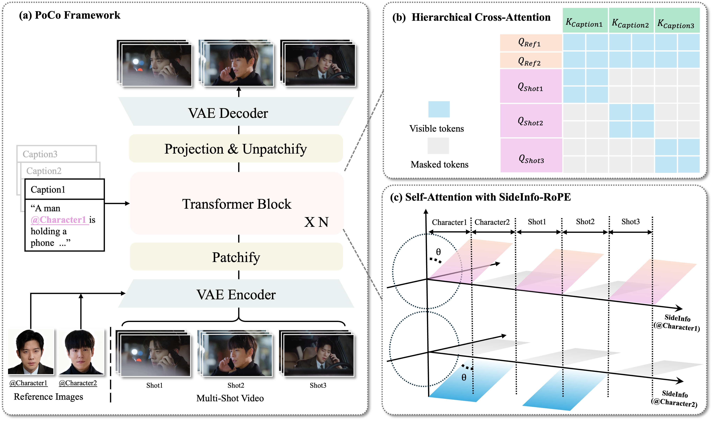

# PoCo: Rethinking Position Embedding as a Context Controller for Multi-Reference and Multi-Shot Video Generation

[Project Page](https://poco-multiref-multishot.github.io/) | [CVPR 2026](https://cvpr.thecvf.com/Conferences/2026) | Paper coming soon

PoCo is a multi-reference, multi-shot video generation method for accurate subject control and strong cross-shot consistency. It introduces **SideInfo-RoPE** and **Hierarchical Cross-Attention (HCA)** to reduce reference confusion when multiple characters have highly similar appearances.

## Highlights

- Precise shot-to-reference control in multi-reference, multi-shot video generation.
- Better cross-shot identity and background consistency under highly similar references.
- A simple extension of RoPE with an explicit side-information axis.
- Built with **SideInfo-RoPE + HCA** for controllable and coherent generation.

## Project Page Preview

## Selected Cases

### Case 1

Reference images:

  
  

Video: [demo1.mp4](PoCo_video/demo1/demo1.mp4)

### Case 2

Reference images:

  
  

Video: [demo2.mp4](PoCo_video/demo2/demo2.mp4)

### Case 3

Reference images:

  
  

Video: [demo3.mp4](PoCo_video/demo3/demo3.mp4)

### Hard Cases: Similar-Reference Confusion

Reference images:

  
  

Videos:

- [poco_group2_confuse1.mp4](PoCo_video/demo5/poco_group2_confuse1.mp4)
- [poco_group2_confuse2.mp4](PoCo_video/demo5/poco_group2_confuse2.mp4)

## Pipeline

PoCo integrates reference images, per-shot captions, and latent video features through a multi-shot diffusion transformer. The method is built around:

- **SideInfo-RoPE**: augments RoPE with a side-information axis for reference-aware phase control.
- **Hierarchical Cross-Attention (HCA)**: aligns each shot with its corresponding caption while keeping global reference guidance.

## News

- `2026-04` Project page released.
- `2026-04` Demo videos and pipeline visualization released.
- `Coming soon` We will release the **SideInfo-RoPE + HCA** model code.
- `Coming soon` More qualitative cases and paper links will be added here.

## Code Release Plan

The first planned open-source release will focus on the core components of PoCo:

- SideInfo-RoPE
- Hierarchical Cross-Attention (HCA)
- Minimal training and inference code for multi-reference, multi-shot generation

## Links

- Project page: [poco-multiref-multishot.github.io](https://poco-multiref-multishot.github.io/)
- GitHub owner: [byhuang123](https://github.com/byhuang123)

## Contact

For questions or collaboration, please contact:

- Binyuan Huang
- Yuning Lu: [luyuningx@gmail.com](mailto:luyuningx@gmail.com)
